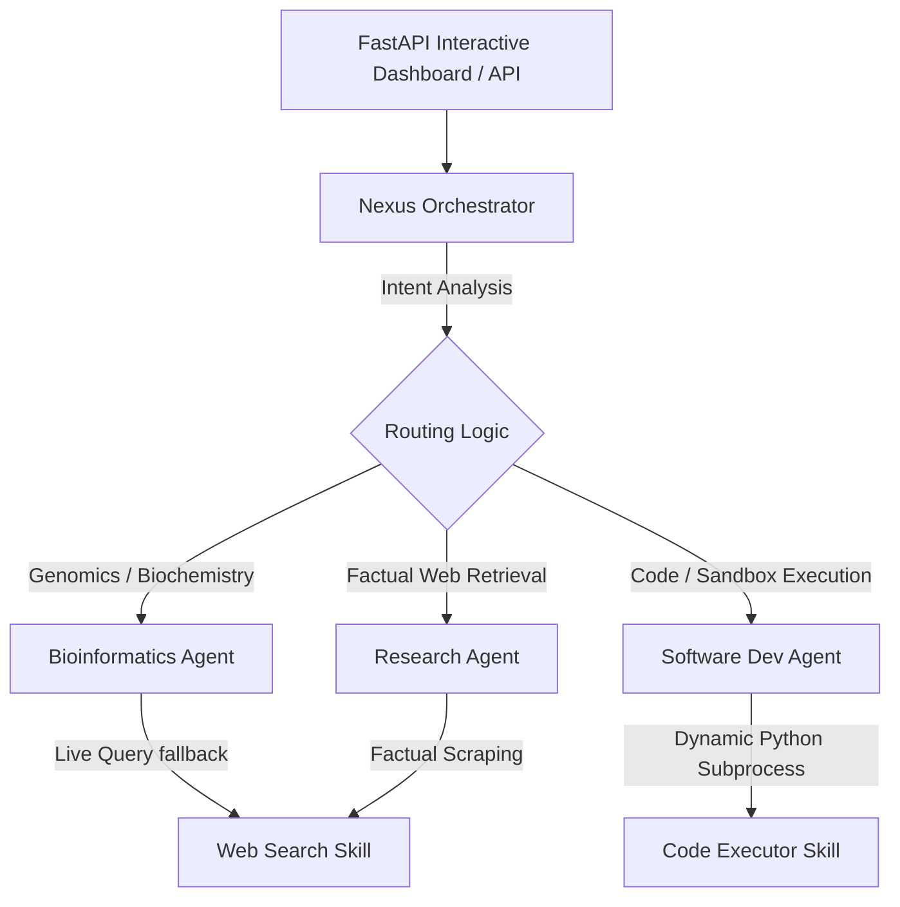

# HI·NEXUS 🌌

HI·NEXUS is an elite, multi-agent autonomous framework built to seamlessly integrate intelligence across three crucial boundaries: live web research, advanced bioinformatics, and secure sandboxed software development. Driven by a centralized dynamic orchestrator and exposed via a robust FastAPI gateway, HI·NEXUS routes tasks dynamically, executes code, processes genetic material, and synthesizes knowledge.

## 🚀 Key Architectural Pillars



### 1. 🧠 Centralized Orchestrator (`orchestrator/main_orchestrator.py`)
Acts as the brain of the platform. Evaluates incoming user prompts to deduce intent using semantic matching. Coordinates multi-agent dispatches and outputs clean, unified responses.

### 2. 🔍 Research Agent (`agents/research_agent.py`)
Formulates key search terms, queries live information sources, and parses records using the `web_search` skill. Integrates with LLMs (Gemini/OpenAI) to summarize findings, or uses local aggregators as offline fallback.

### 3. 🧬 Bioinformatics Agent (`agents/bio_agent.py`)
A highly specialized biochemical assistant. Features biological sequence parsing:
*   **Transcription**: Transcribes DNA nucleotide structures to RNA.
*   **Translation**: Translates codons into corresponding amino acid peptide chains.
*   **GC Content**: Computes thermal stability metrics.
*   **Scientific Synthesis**: Investigates medical or chemical topics dynamically.

### 4. 💻 Software Development Agent (`agents/dev_agent.py`)
Responsible for code writing, execution, and debugging. Generates targeted Python solutions, runs them inside a temporary sandbox using the `code_executor` skill, and analyzes the return codes/outputs.

---

## 🛠️ Integrated Skills

*   **`skills/web_search.py`**: A robust search interface. Dynamically attempts API calls via **Tavily** or **Serper** if keys are supplied. Otherwise, executes a fallback scraper against **DuckDuckGo** or returns an offline mock.
*   **`skills/code_executor.py`**: A secure localized Python sandbox utilizing Python's `subprocess` engine to safely compile and execute dynamic programs with safety constraints.

---

## 📦 Installation & Quick Start

Ensure Python 3.9+ is installed.

### 1. Clone & Enter Directory
```bash
git clone https://github.com/Leonidascdmx/Nexus-chi.git
cd Nexus-chi
```

### 2. Install Dependencies
```bash
pip install fastapi uvicorn requests
```
*(Optional) If you want to enable advanced generative synthesis, install the official LLM clients:*
```bash
pip install google-generativeai openai
```

### 3. Configure Credentials (Optional)
Create or export these keys to unleash the complete cognitive capacity of HI·NEXUS:
```bash
# Windows PowerShell
$env:GEMINI_API_KEY="your-key-here"
$env:OPENAI_API_KEY="your-key-here"
$env:TAVILY_API_KEY="your-key-here"
```

### 4. Start the Application Gateway
Run the FastAPI application from the project root:
```bash
python -m uvicorn api.main:app --reload --port 8000
```

Open your browser and navigate to **`http://localhost:8000`** to access the stunning HI-NEXUS Control Panel!

---

## 📂 Codebase Organization

```text
Nexus-chi/
├── agents/
│   ├── research_agent.py     # Deep factual data retrieval agent
│   ├── bio_agent.py          # Molecular biology & bioinformatics agent
│   └── dev_agent.py          # Code synthesis & sandboxed execution agent
├── skills/
│   ├── web_search.py         # Google/Tavily/Serper & DuckDuckGo search integration
│   └── code_executor.py      # Multi-platform Python code subprocess execution
├── orchestrator/
│   └── main_orchestrator.py  # Intent parser & agent workflow scheduler
├── api/
│   └── main.py               # FastAPI router & glassmorphic control dashboard
├── docs/
│   └── ARCHITECTURE.md       # Architecture spec
└── README.md                 # Project handbook (this file)
```